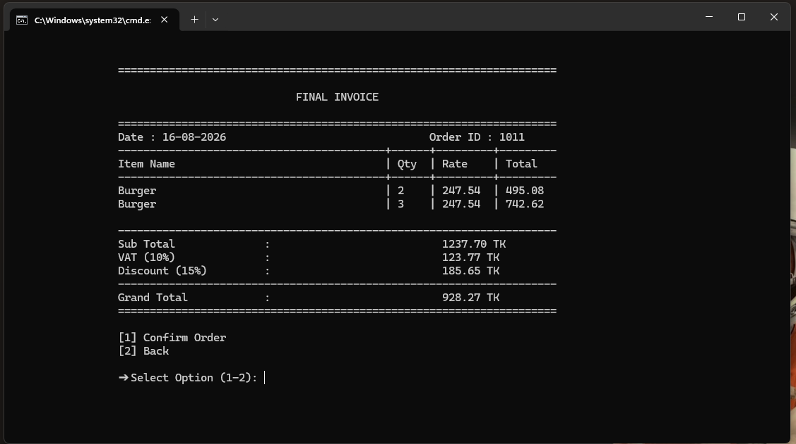
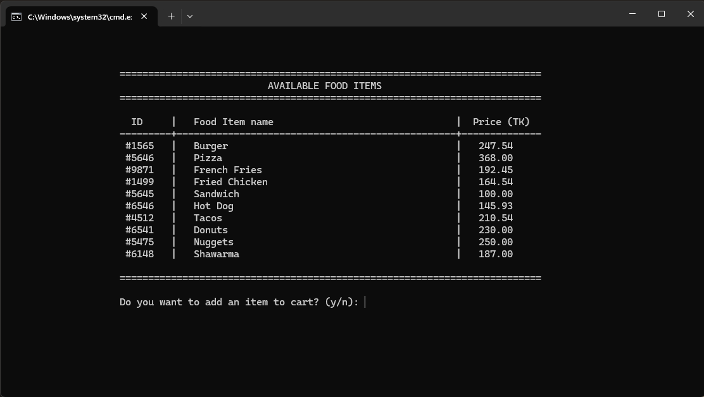
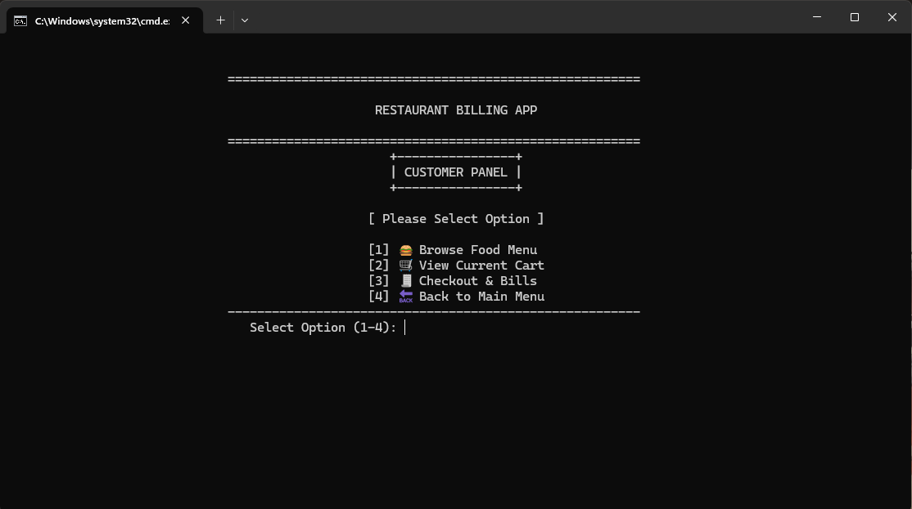

# restaurant-billing-system-c
A modular Restaurant Order-Billing Management System developed in C for managing customers, menu items, orders, billing, administration, and reports using file-based data storage.
# 🍽️ Restaurant Order-Billing Management System

A **console-based Restaurant Order-Billing Management System** developed using the **C programming language** as a collaborative project for the **Software Development Capstone Project (SE-133)** at Daffodil International University.

The system provides a modular solution for managing restaurant operations, including customers, menu items, orders, billing, administration, and reports.

## ✨ Features

* 👨‍💼 Admin management
* 👤 Customer management
* 🍔 Menu management
* 🧾 Order management
* 💰 Billing system
* 📊 Report generation
* ⭐ Customer review management
* 💾 File-based data storage
* 🖥️ Console-based user interface
* 🧩 Modular C programming structure

## 🛠️ Technologies Used

* **C Programming**
* **File Handling**
* **Structures**
* **Functions**
* **Pointers**
* **Modular Programming**
* **Standard C Libraries**

## 📂 Project Structure

```text
restaurant-order-billing-management-system/
│
├── data/
│   ├── admin.dat
│   ├── cart.dat
│   ├── menu.dat
│   ├── orders.dat
│   └── reviews.dat
│
├── include/
│   ├── admin.h
│   ├── billing.h
│   ├── console.h
│   ├── customer.h
│   ├── main.h
│   ├── menu.h
│   └── report.h
│
├── src/
│   ├── admin.c
│   ├── billing.c
│   ├── customer.c
│   ├── menu.c
│   ├── report.c
│   └── console.c
│
├── windows/
│   └── Windows-specific files
│
├── main.c
├── run.bat
├── README.md
└── data.zip
```

## ⚙️ Main Modules

### 👨‍💼 Admin Module

Handles administrative operations and system management.

### 👤 Customer Module

Manages customer information and customer-related operations.

### 🍔 Menu Module

Handles restaurant menu items and menu-related operations.

### 🛒 Order & Cart Module

Manages cart items and customer orders.

### 💳 Billing Module

Processes orders and generates the final restaurant bill.

### 📊 Report Module

Generates useful reports based on restaurant data.

### ⭐ Review Module

Stores and manages customer reviews.

## ▶️ How to Run

### Using GCC

Compile the source files:

```bash
gcc src/*.c main.c -Iinclude -o restaurant
```

Run the program:

**Windows:**

```bash
restaurant.exe
```

**Linux/macOS:**

```bash
./restaurant
```

### Windows Batch File

If the project is configured with the provided batch script, it can also be executed using:

```bash
run.bat
```
## 📂 Preview






## 👥 Team Members

**Group No.: 03**

| Name             | Student ID |
| ---------------- | ---------- |
| Sohan Parves     | 252-35-462 |
| Rahat Rahman Jim | 252-35-463 |
| Raisul Islam     | 252-35-491 |
| Shahidul Alif     | 252-35-497 |
| Sazid Hasan      | 252-35-514 |

## 🎓 Academic Information

| Information | Details                               |
| ----------- | ------------------------------------- |
| University  | Daffodil International University     |
| Department  | Software Engineering                  |
| Course      | Software Development Capstone Project |
| Course Code | SE-133                                |
| Batch       | 45                                    |
| Section     | J1                                    |
| Semester    | Summer 2026                           |
| Group       | 03                                    |

## 🎯 Project Objective

The objective of this project is to develop a practical restaurant management application while applying fundamental and intermediate concepts of **C programming**.

The project focuses on:

* Modular software development
* File-based data management
* Structured programming
* Problem-solving
* Data processing
* Team collaboration
* Software development practices

## 🚀 Future Improvements

* Graphical User Interface (GUI)
* Database integration
* Online food ordering
* Secure user authentication
* Inventory management
* Digital payment integration
* Advanced analytics and reporting
* Web-based restaurant management

## 📌 Academic Project

This project was developed as part of the **Software Development Capstone Project (SE-133)** at **Daffodil International University**.

---

⭐ If you find this project useful, consider giving the repository a star.
